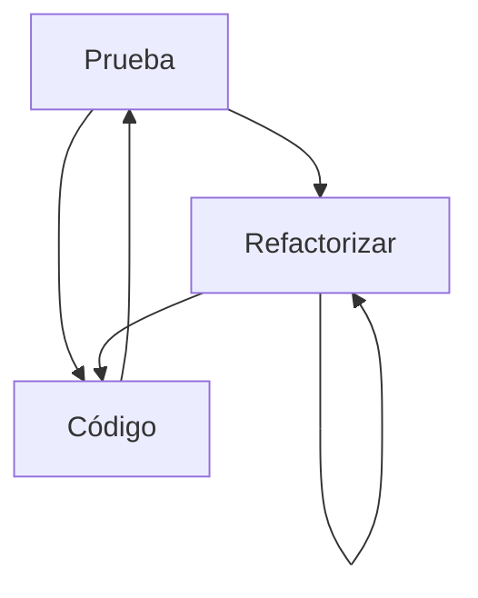

#   Servidor - Hagámoslo
>  Este es un servidor del proyecto **Hagámoslo** el cual fue presentado para la materia de Aplicaciones Móviles en el Instituto Tecnológico de Teziutlán.

El servidor fue desarrollado con ayuda de algunas librerías de terceros, como:

Si desea descargar el código no se olvide de ejecutar el comando:

    npm install

## Librerías

| Librería     | Descripción  |
| -----------  | ----------- |
| cors      |   Permite que el servidor pueda recibir peticiones de otros dominios |
| express   |   Express es un framework de Node.js que facilita el desarrollo de aplicaciones web. |
| jest      |   Jest es un framework de JavaScript para el desarrollo de pruebas unitarias. |
| tslint    |   TSLint es una herramienta de linting para JavaScript. |
| typescript|   Typescript es un lenguaje de programación orientado a objetos. |
| Prisma CLI - ORM | Prisma es un ORM para Node.js. |
| bcryptjs  |   bcryptjs es una librería de Node.js para encriptar contraseñas. |
| express-fileupload | Es un middleware para el marco Express que le brinda una manera fácil de manejar la carga de archivos usando el marco Express. |
| dotenv |   Dotenv es una librería para leer archivos de configuración de entorno. |

## Pruebas Unitarias

Se han realizado pruebas unitarias con **JEST** solamente en la carpeta Sevice debido a que es la única que contiene la lógica del proyecto.

Para poder corrrer las pruebas basta con ejecutra el comando:

    npm run test

## CI/CD
Es una herramienta que nos permite automatizar el proceso de desarrollo de nuestros proyectos.
Se utilizó [GitHub Actions](https://docs.github.com/en/actions) para automatizar el proceso de desarrollo.

Cada vez que se haga un commit a la rama master y pase las pruebas unitarias procederá a construir el proyecto y desplegarlo en el servidor de Azure.

